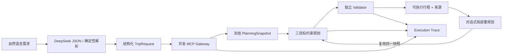

<p align="center">
  
</p>

<h1 align="center">TripWeaver</h1>

<p align="center">
  <strong>MCP-powered, constraint-validated conversational travel planning.</strong><br>
  多源事实、确定性规划、可验证输出，以及不会在对话中悄悄失真的局部重规划。
</p>

<p align="center">
  <a href="https://github.com/HirasawaNiji/TripWeaver/actions/workflows/ci.yml"></a>
  
  
  <a href="LICENSE"></a>
</p>

TripWeaver 不是“让大模型自由生成旅游攻略”的包装层。它统一接入地图、铁路、航班与住宿位置数据，把用户自然语言转换成结构化约束，在冻结的数据快照上生成三套候选方案，再由独立 Validator 检查时间、预算、营业窗口、换乘与来源完整性。

LLM 只负责理解偏好与解释结果；关键计算、方案选择和可行性判断始终由程序完成。

## What makes it different

| 能力 | TripWeaver 的实现 |
|---|---|
| 多源接入 | MCP Gateway 统一高德、12306 社区 MCP 与飞常准，包含 Schema 归一化、超时、重试、限流和健康检查 |
| 可重复规划 | 每个会话冻结 `PlanningSnapshot`；修改方案不会重新查询外部服务，除非用户明确刷新 |
| 硬约束 | 确定性 Planner 处理预算、日期、开放时间、首末日窗口、住宿价格和换乘缓冲 |
| 对话式修改 | 三选一、交通/住宿锁定、景点替换、撤销、结构化 Diff 与局部重规划 |
| 诚实失败 | 预算不足、交通窗口和锁定冲突返回稳定错误码与可操作的放宽建议，不让 LLM 编造结果 |
| 可观测性 | LLM、MCP、Planner、Validator Trace，包含延迟、Token、来源、TTL、缓存与降级状态 |
| 可演示性 | 完全离线 DEMO、实时 LIVE 模式、`doctor` 自检、一键启动和固定评测集 |

## Verified results

| 质量指标 | 当前结果 |
|---|---:|
| 自动化测试 | **90 passed** |
| 固定规划评测 | **120 / 120** |
| 多轮 Agent 评测 | **40 / 40** |
| 硬约束满足率 | **100%** |
| 来源完整率 | **100%** |
| 快照复用率 | **100%** |
| 当前 LIVE Provider 就绪度 | **3 / 3** |
| Pyright | **0 errors** |

评测报告保存在 [`reports/`](reports/)；所有比例均由仓库中的固定测试集实际运行得出。

## How it works



规划目标提供 `BUDGET`、`BALANCED`、`TIME` 三种策略。用户可以先比较方案，再锁定满意的去程、返程或住宿，只调整剩余部分。

## Quick start

需要 Python 3.12+ 和 [uv](https://docs.astral.sh/uv/)。离线演示不需要任何 API Key，也不需要 Node.js。

```powershell
git clone https://github.com/HirasawaNiji/TripWeaver.git
cd TripWeaver
uv sync --frozen
uv run tripweaver doctor
uv run tripweaver serve
```

打开 [http://127.0.0.1:8000](http://127.0.0.1:8000)。

项目使用 `copy` 安装模式，避免 Windows 上 uv 缓存位于 C 盘、项目位于 E 盘时出现跨磁盘硬链接警告。

### Enable LIVE mode

```powershell
Copy-Item .env.example .env
```

在私有 `.env` 中配置：

```dotenv
AMAP_MAPS_API_KEY=your_amap_web_service_key_here
RAILWAY_MCP_ENABLED=true
VARIFLIGHT_MCP_ENABLED=true
VARIFLIGHT_API_KEY=your_variflight_api_key_here

DEEPSEEK_ENABLED=true
DEEPSEEK_API_KEY=your_deepseek_api_key_here
DEEPSEEK_MODEL=deepseek-v4-flash
```

铁路与飞常准 MCP 使用固定 npm 包，需要 Node.js 18+ 和 `npx`。启动前运行只读能力探测：

```powershell
uv run tripweaver doctor --live
uv run tripweaver serve
```

`.env`、本地数据库、缓存和凭证均已加入 `.gitignore`。Doctor 和 Trace 不输出 API Key、完整端点参数、Prompt 或上游正文。

## Data sources and trust boundary

| 数据域 | 来源 | 使用方式 | 降级策略 |
|---|---|---|---|
| 地图、POI、天气、市内路线 | 高德官方 MCP | 实时查询与严格归一化 | Fixture POI / 估算路线并明确标记 |
| 铁路 | `12306-mcp@0.3.10` 社区项目 | 只读余票与价格查询 | 单程 Fixture，不登录 12306 |
| 航班 | `@variflight-ai/variflight-mcp@1.0.3` | 只读航班价格与舱位 | 单程 Fixture，不预订 |
| 住宿 | 高德酒店 POI + 本地价格策略 | 推荐位置与住宿区域 | 用户价格或明确的评分档估算 |
| 语言理解 | DeepSeek JSON Output | 结构化需求、修改意图与解释 | 确定性解析器 |

每个外部事实都携带 `LIVE`、`CACHED`、`FIXTURE` 或 `ESTIMATED` 状态、查询时间、TTL 和脱敏来源。

## API and CLI

主要接口：

- `GET /health`：进程和 LLM 模式
- `GET /readiness`：无敏感信息的 DEMO / LIVE 就绪度
- `POST /v2/sessions`：创建 DEMO 或 LIVE 会话
- `POST /v2/sessions/{id}/revise`：局部重规划
- `POST /v2/sessions/{id}/refresh`：显式刷新外部数据
- `GET /v2/sessions/{id}/trace`：执行 Trace

常用 CLI：

```powershell
uv run tripweaver demo
uv run tripweaver alternatives "从北京去上海玩3天，2026-10-01出发，2个人，预算8000元"
uv run tripweaver evaluate
uv run tripweaver evaluate-agent
uv run tripweaver metrics
```

Provider 调试命令见 [`docs/MCP_GATEWAY.md`](docs/MCP_GATEWAY.md)。

## Project structure

```text
src/tripweaver/
├── conversation/   # 会话、快照、锁定、Diff 与局部重规划
├── mcp_gateway/    # MCP 注册、调用、重试、限流、缓存与 Trace
├── providers/      # 高德、铁路、飞常准 Adapter
├── planner/        # 确定性规划、候选生成与结构化冲突
├── validator/      # 独立硬约束验证
├── llm/            # DeepSeek JSON 边界与确定性回退
├── evaluation/     # 120 组规划评测与 40 组 Agent 评测
├── operations/     # Doctor 与演示就绪度
├── web/            # 内置响应式 Agent 工作台
└── api.py           # FastAPI 交付层
```

## Scope

TripWeaver 是查询型作品集项目，不提供：

- 12306 或 OTA 登录
- 抢票、预订、支付和订单写入
- 注册城市之外的任意全球路线
- 酒店实时可售房型与 OTA 报价
- 面向公网的身份认证与多租户部署

外部 MCP 不可用时，系统会显式使用缓存或 Fixture，并把降级写入方案与 Trace。

## Documentation

- [Architecture V2](docs/ARCHITECTURE_V2.md)
- [Phase 20–23: Live Conversational Agent](docs/PHASE_20_23_LIVE_AGENT.md)
- [Phase 24: Demo Readiness](docs/PHASE_24_READINESS.md)
- [Three-minute Demo Script](docs/DEMO_SCRIPT.md)
- [Release Checklist](docs/RELEASE_CHECKLIST.md)
- [Development roadmap](docs/ROADMAP.md)

## License

Released under the [MIT License](LICENSE).
